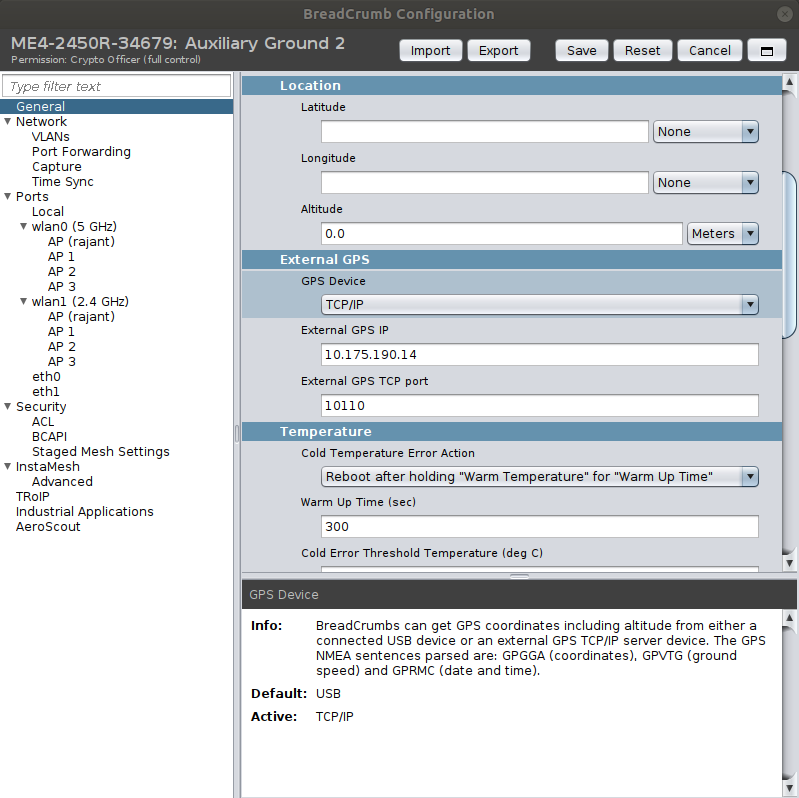
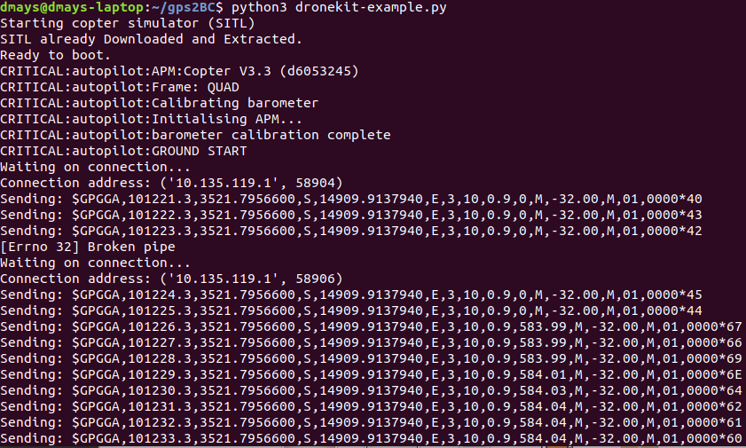
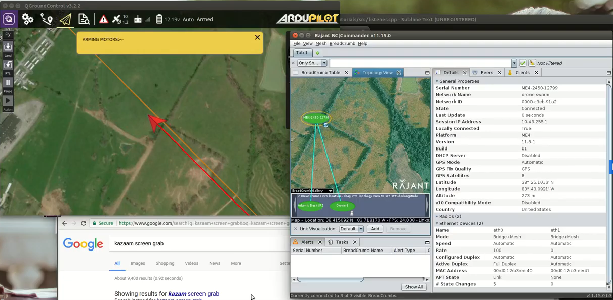

# gps2bc-dronekit

This is software that interfaces with DroneKit, pulls GPS information, formats it into a NMEA-0183 GGA string, and serves it to Rajant Breadcrumbs via a TCP Server. The TCP server runs in a separate thread to allow for independant program flow from main DroneKit software, and is passed data via a Queue. 

## Quick Installation:
This guide uses the DroneKit SITL drone to provide an example for implementation into your own DroneKit software. (**NOTE:** The pre-compiled DroneKit SITL drone will only run on x86 devices! It will **not** work on ARM-based devices like a Raspberry Pi. To test on such devices, you must use a real FCU or compile the DroneKit SITL yourself.)
  1. [Install DroneKit and setup Python dependancies](https://dronekit-python.readthedocs.io/en/latest/guide/quick_start.html)
  1. Clone repo
  1. Ensure the network adapter of the device is set to an IP address in the range 10.x.x.x and Netmask 255.0.0.0
  1. Go into BC|Commander (using the device you're configuring or separate computer)
      1. Select and Configure the Breadcrumb associated with the device you are configuring
      1. Under "General", there is a section titled "External GPS"
      1. Set *GPS Device* to "TCP/IP"
      1. Set *External GPS IP* to the IP address of your device
      1. Save and reboot the Breadcrumb    
  
  1. Navigate to repo directory on device
  1. Run using the following command: `python3 dronekit-example.py`
  1. You should see the following output. First will be output from the SITL drone being initialized. The program will wait for a connection. Once connected, the program will print the connection address, which corresponds to the Breadcrumb that you setup. The NMEA strings that are generated and sent are printed to the console. *Note:* Upon initial connection, the Breadcrumb will disconnect and reconnect once. That is normal.
  
 

## Testing:
  1. Once started, you can connect to the SITL using GCS software via TCP using `127.0.0.0:5763`
  1. Create a flight plan, upload, and take-off
  1. In BC|Commander, go to Topology View and select the Map mode.
  1. The position of your radio node should move and correlate with the position of the vehicle in the GCS


## Usage:
To use within your own DroneKit software, you need to do a few things. Check out `dronekit-example.py` for an implementation example.
  1. Place `gps2BC.py` in your main software directory
  1. Add `include gps2BC` in your main program
  1. Add the following libraries into your main program:
```
from time import sleep
from time import localtime
import math
from multiprocessing import Queue
import threading
```
  4. Instantiate nmeaFrame class, setup Queue and thread for TCP server:
```
#Main Entry Point
nmea_class = gps2BC.nmeaFrame()		#instantiate nmeaFrame class
q = Queue()				#The queue used to communicate between main and auxiliary thread
thread = threading.Thread(target=gps2BC.mainTCPLoop, args=(q, ))	#Setup thread
thread.start()                                                          #Launch Thread
```
  5. In your main program loop, gather GPS data from DroneKit vehicle and convert it:
```
gps2BC.convertFrameNMEA(gps2BC.grabFrameNav(vehicle), nmea_class)	#Gather dronekit GPS data and convert it into the nmeaFrame class
```
  6. Generate and transfer NMEA string to TCP server
```
q.put(nmea_class.generateNMEA())			#Generate final NMEA string from nmeaFrame class and pop onto queue
```
  7. gps2BC will use whatever GPS data it currently has to send out NMEA strings to the Breadcrumb at a rate of 1Hz. That is, your program does not have to update the data for the TCP server at any particular rate for it to continue working. However, an update rate of 1Hz is recommended.
